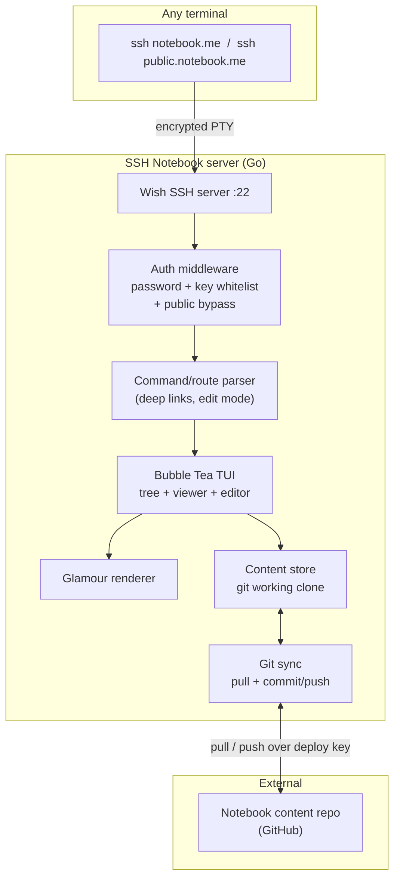

# SSH Notebook — Master Plan

> A single command — `ssh notebook.<yourdomain>` — that opens your personal notebook (a directory of Markdown files) in any terminal, on any machine, with zero install for the reader. Private by default (password + your SSH keys), with opt-in public pages that need no auth.

Inspired by [terminal.shop](https://www.terminal.shop): SSH is used as an *application delivery protocol*, not a remote shell. The user's terminal is just a renderer; the notebook app runs server-side.

---

## 1. Vision & Goals

**What it is:** An SSH server that, instead of giving you a shell, drops you into a Terminal UI (TUI) that browses and renders a tree of Markdown files. You can read, search, and edit notes from anywhere.

**Why SSH:**
- Zero install for readers — every OS already ships an `ssh` client.
- Identity is free — your SSH key *is* your login.
- Encrypted transport, no TLS certs to manage.
- Resilient over flaky connections; scriptable (`ssh notebook.me notes/x.md`).
- High cool-factor.

**Non-goals (for now):** multi-tenant SaaS, a web frontend, real-time collaboration, rich media beyond terminal-capable image protocols.

---

## 2. Confirmed Decisions

| Area | Decision |
|------|----------|
| Language / stack | **Go + Charm**: [Wish](https://github.com/charmbracelet/wish) (SSH), [Bubble Tea](https://github.com/charmbracelet/bubbletea) (TUI), [Lip Gloss](https://github.com/charmbracelet/lipgloss) (styling), [Glamour](https://github.com/charmbracelet/glamour) (Markdown rendering) |
| Content source | **Git repo** — notebook is a versioned repo of `.md` files |
| Auth | **Password for private access + whitelist of my SSH public keys**; a separate **public** entry (subdomain/command) with no auth |
| MVP scope | Viewer **+ in-terminal editing that writes back** |
| Repo | Public GitHub repo `ssh-notebook` |
| Hosting | **Open decision — see §6 comparison** |

---

## 3. High-Level Architecture



### Session lifecycle
1. `ssh` client connects; server presents a pinned host key.
2. Auth middleware decides: public route → allow anonymous read-only; private route → require password **or** a whitelisted public key fingerprint.
3. Wish allocates a PTY and starts a per-session Bubble Tea program.
4. The route parser inspects the requested command (`ssh notebook.me notes/x.md`, `-t edit ...`) and sets the initial view.
5. TUI reads from the content store (a local git clone); Glamour renders Markdown to styled ANSI.
6. Edits (authenticated only) write to the working tree, then commit + push.

---

## 4. Component Breakdown

| Component | Responsibility | Key packages |
|-----------|----------------|--------------|
| SSH server | Accept connections, PTY, host key, middleware stack | `wish`, `gliderlabs/ssh` |
| Auth | Password check, key-fingerprint whitelist, public bypass, per-session identity/permissions | `wish`, `crypto/ssh` |
| Router | Map SSH command args to initial view + mode (read/edit) | stdlib |
| TUI shell | App state, layout, key bindings, responsive sizing | `bubbletea`, `lipgloss`, `bubbles` |
| File tree | Navigate the notebook directory | `bubbles/list` or custom tree |
| Viewer | Render Markdown, scroll, code highlighting | `glamour`, `bubbles/viewport` |
| Editor | Edit buffer, save-back (auth only) | `bubbles/textarea` |
| Search | Filename + full-text search | `bleve` or simple walk + grep |
| Content store | Abstraction over the notebook files | stdlib `io/fs` |
| Git sync | Pull updates, commit/push edits, conflict policy | `go-git` or shell `git` |
| Config | Domains, key whitelist, password hash, repo URL, public paths | env + small config file |
| Ops | Structured logging, panic recovery, metrics | `wish/logging`, `slog` |

---

## 5. MVP Segmentation

Ship in thin vertical slices; each is independently demoable.

### v0.1 — "Hello, notebook" (read-only, local dir)
- Wish server with password auth + host key persistence.
- Bubble Tea shell: static file tree of a local directory.
- Glamour renders a selected `.md`; viewport scrolling.
- Deep link: `ssh host path/to/file.md` opens that file.
- **Exit criteria:** connect, browse, read a note over SSH locally.

### v0.2 — Auth model
- Password for private access (hashed, from config/secret).
- SSH public-key whitelist → authenticated identity, no password.
- Public bypass: `public.` subdomain **or** a `public` command → read-only, no auth, restricted to a `public/` subtree.
- **Exit criteria:** private needs password/key; public path is open and sandboxed.

### v0.3 — Git-backed content + sync
- Notebook content = a git repo cloned on the server.
- Scheduled `git pull` with a safe policy (see §7 conflict handling).
- **Exit criteria:** push to content repo → changes appear in the TUI after sync.

### v0.4 — Editing that writes back
- Editor view (auth only) with `bubbles/textarea`.
- Save → write file → `git add/commit/push` via deploy key/token.
- Guard rails: no editing on public routes; conflict-safe commits.
- **Exit criteria:** edit a note in-terminal, changes are committed & pushed.

### v0.5 — Search & polish
- Filename fuzzy find + full-text search.
- Lip Gloss theming, help bar, responsive breakpoints, resize handling.
- **Exit criteria:** find any note by name/content; UI feels finished.

### v0.6 — Deploy
- Containerize; deploy to chosen host (see §6); DNS + host-key publication.
- **Exit criteria:** `ssh notebook.<yourdomain>` works from a fresh machine.

### Later / stretch
- Inline images (Kitty/iTerm2 protocols) for terminals that support them.
- Multiple notebooks / namespaces.
- Audit log, rate limiting, fail2ban-style protection.
- Per-file public sharing (mark front-matter `public: true`).

---

## 6. Hosting Comparison (open decision)

| Option | Est. cost | SSH/TCP :22 | Persistent disk | Deploy UX | Ops burden | Best when |
|--------|-----------|-------------|-----------------|-----------|------------|-----------|
| **Fly.io** | ~$5–15/mo | Yes (dedicated IPv4 ~$2/mo) | Volumes | `fly deploy` from git, Dockerfile | Low | You want push-to-deploy + minimal ops **(recommended)** |
| **VPS** (Hetzner ~€4, DO $6) | $5–8/mo | Yes, full control | Native disk | `git pull` + `systemd` service, or Docker | Medium (patching, firewall) | You want full control & lowest cost |
| **Railway / Render** | $5–20/mo | TCP proxy varies — verify raw :22 support | Volumes | Git-based | Low | You prefer a PaaS but confirm raw TCP first |
| **AWS ECS Fargate** | $15–40/mo | Yes (NLB) | EFS/S3 sync | IaC (SST/Terraform) | High | You want terminal.shop-grade scaling (overkill for solo) |
| **Home server + tunnel** | ~$0 | Via Cloudflare Tunnel / Tailscale | Local | Manual | Medium | Free, hobby, you already run a box |

**Recommendation:** Start on **Fly.io** (git deploy, persistent volume, straightforward dedicated IP for port 22). Revisit a VPS if you want to shave cost or need custom networking.

> ⚠️ **Port 22 note:** Whatever host you pick, verify it exposes a *raw TCP* port for SSH (not just HTTP). PaaS platforms that only proxy HTTP won't work; you may need to listen on a non-22 port and map it, or use the platform's TCP service feature.

---

## 7. Key Design Tensions & Decision Points

These need your input before/at the relevant milestone:

1. **⚠️ Edit + scheduled-pull conflict (v0.3/v0.4).** In-terminal edits and a background `git pull` can clobber each other. Proposed policy:
   - Edits always `commit` immediately, then `push`.
   - Scheduled sync uses `git pull --rebase --autostash` and only runs when the tree is clean, or is disabled while an edit session is active.
   - **Decision:** OK with "edits are the source of truth, pull rebases on top"? Or should the server be push-only (you edit locally, it never edits)?

2. **Content repo vs app repo.** Keep the notebook Markdown in a **separate private repo** from this app's code (recommended — keeps notes out of the public `ssh-notebook` repo). **Decision:** confirm separate content repo + its visibility.

3. **Push credentials.** The server needs write access to push edits: a **deploy key** (SSH) or a **fine-grained PAT**. **Decision:** which, and where stored (host secret manager / env)?

4. **Password storage.** Single shared password (hashed, e.g. bcrypt) vs per-user. MVP = single hashed password in a secret. **Decision:** confirm single-password MVP.

5. **Public surface.** Public via a `public.` **subdomain** (needs extra DNS + cert-free SSH listener) vs a `public` **command/arg** on the same host. Command-arg is simpler. **Decision:** which UX?

6. **Host key trust.** Publish the server's Ed25519 host key (like terminal.shop does on its homepage) so users can pin it. **Decision:** where do you publish it (README? a landing page?).

7. **Domain.** What hostname? (`notebook.<yourdomain>`?) Needed for DNS + host-key setup at v0.6.

---

## 8. Repo Layout (proposed)

```
ssh-notebook/
├── cmd/
│   └── ssh/main.go          # server entrypoint
├── internal/
│   ├── server/              # wish setup, middleware, host key
│   ├── auth/                # password + key whitelist + public bypass
│   ├── tui/                 # bubbletea model: tree, viewer, editor
│   ├── content/             # fs abstraction over notebook
│   └── gitsync/             # pull/commit/push
├── docs/
│   └── masterplan.md        # this file
├── config.example.yaml
├── Dockerfile
├── go.mod
└── README.md
```

---

## 9. Milestone Checklist

- [ ] v0.1 Read-only viewer over SSH (local dir)
- [ ] v0.2 Auth model (password + key whitelist + public bypass)
- [ ] v0.3 Git-backed content + scheduled sync
- [ ] v0.4 In-terminal editing with commit/push
- [ ] v0.5 Search + UI polish
- [ ] v0.6 Deploy + DNS + published host key

---

## 10. Prerequisites

- Install Go (not currently on this machine): `brew install go`
- GitHub CLI (present, authenticated as `SarkarShubhdeep`)
- A domain with DNS you control (for v0.6)
- A host account (Fly.io / VPS) for v0.6
